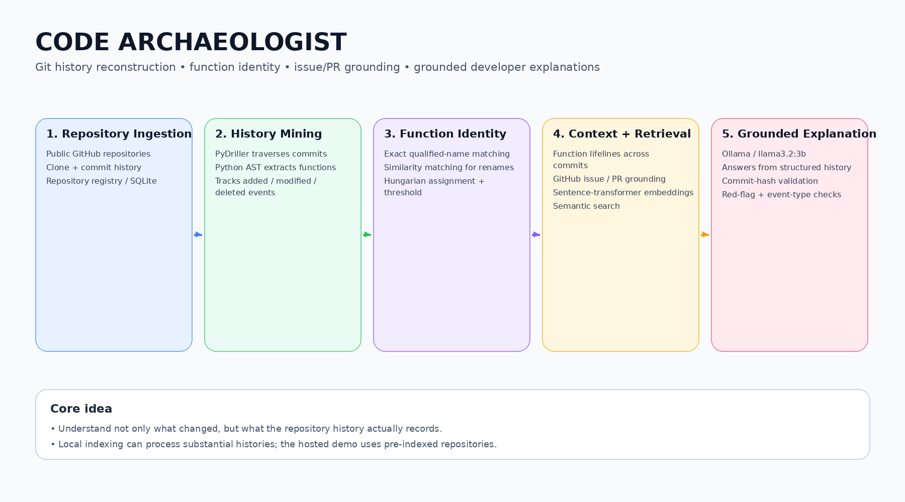

# 🧭 Code Archaeologist — Git History Reconstruction & Grounded RAG

> **Understand not just what the code does, but why the repository history records that it changed.**

[](https://www.python.org/)
[](https://fastapi.tiangolo.com/)
[](https://github.com/ishepard/pydriller)
[](#architecture)
[](https://www.docker.com/)

Code Archaeologist is a developer tool for reconstructing how Python code evolves across Git history. It tracks functions across commits—even when functions are renamed or refactored—connects code changes to GitHub issues/PRs, and uses retrieved historical context to answer developer questions.

## ✨ What it does

- 🕰️ Mines Git history with **PyDriller**
- 🌳 Extracts Python functions with the **AST**
- 🔗 Tracks function identity using **exact-name + similarity matching**
- 🧬 Builds a function lifeline across historical versions
- 🔎 Grounds code history with linked GitHub issues/PRs
- 🧠 Builds semantic embeddings for retrieval
- 💬 Generates explanations using **Ollama / Llama 3.2 3B**
- 🛡️ Verifies cited commit hashes and checks for unsupported event descriptions

## 🏗️ Architecture



> Mermaid source: [`architecture.mmd`](architecture.mmd)

## 🔬 Function identity matching

A simple name lookup breaks when a function is renamed. Code Archaeologist first handles unambiguous exact-name matches and then compares remaining function bodies using similarity scoring and assignment to identify likely rename relationships.

The current pipeline stores commit metadata and function events in SQLite and then enriches the history with GitHub issue/PR information.

## 🤖 Grounded explanations

The explanation layer is deliberately constrained by the structured history it receives. It is instructed not to invent motivations when the available PR/commit data does not establish them.

Verification includes:

- commit-hash validation against known history
- malformed-but-real citation handling
- red-flag phrase scanning
- event-type consistency checks

## 🧰 Tech stack

| Layer | Technologies |
|---|---|
| Git mining | PyDriller, Git |
| Parsing | Python AST |
| Matching | `difflib`, SciPy assignment |
| Storage | SQLite |
| Retrieval | Sentence Transformers |
| LLM | Ollama / Llama 3.2 3B |
| API | FastAPI + Uvicorn |
| Frontend / assets | HTML, CSS, JavaScript |
| Deployment | Docker |

## 🚀 Run locally

```bash
git clone https://github.com/BanuVarsha10/code-archae.git
cd code-archae

pip install -r requirements.txt

# Create .env
GITHUB_TOKEN=your_github_token_here

ollama pull llama3.2:3b
python -m uvicorn app:app --reload
```

Open `http://localhost:8000`.

To index a repository locally, use the **Add repo** flow and provide a public GitHub URL.

### Public demo note

The hosted deployment uses pre-indexed repositories. Live indexing is enabled locally because repository indexing can require substantial CPU, memory and persistent storage.

## 📁 Key files

```text
pipeline.py            → repository cloning + commit/function mining
match_functions.py     → function matching utilities
fetch_issues*.py       → GitHub issue/PR grounding
build_embeddings.py    → semantic representation
explain.py             → grounded explanation + verification
app.py                 → application/API entry point
repo_registry.py       → repository/index status
```

## 🎯 Why it matters

Legacy systems are difficult to understand because the most useful context is often buried in years of commits, refactors and issue discussions.

Code Archaeologist turns that history into searchable, structured context for developers.

---

**Repository:** https://github.com/BanuVarsha10/code-archae
